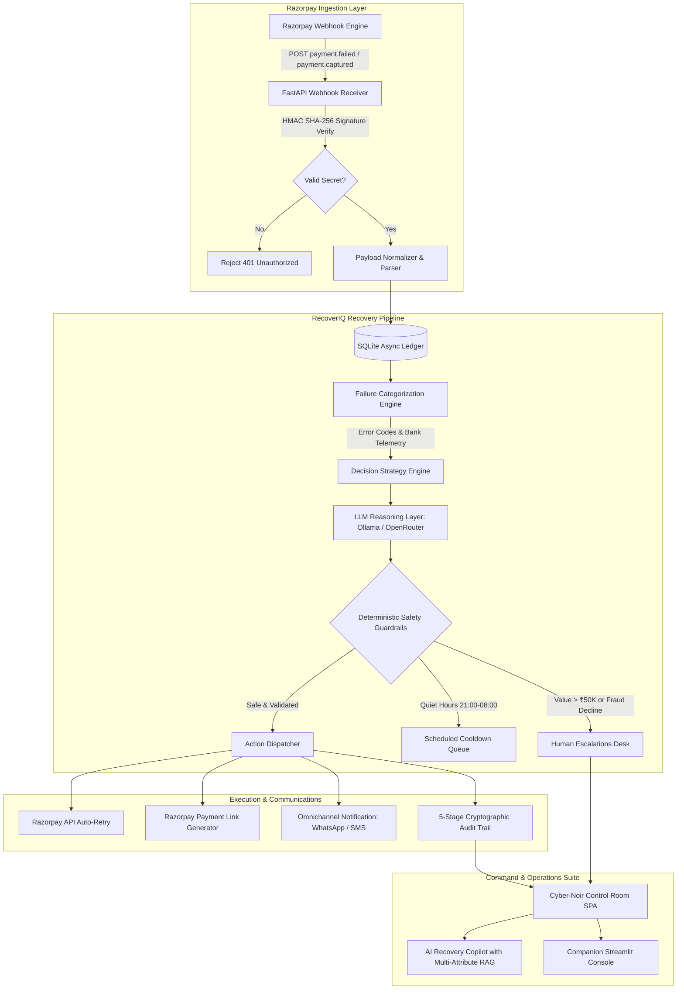

# RecoverIQ — Autonomous AI Revenue Recovery Agent
> **Razorpay Buildathon 2026 Submission**  
> *Transforming failed transactions into recovered revenue with autonomous agents, deterministic guardrails, and an intelligent control room.*

[](https://www.python.org/downloads/)
[](https://fastapi.tiangolo.com)
[](https://razorpay.com)
[](https://openrouter.ai)
[-success)](https://github.com/harshitpal175786/RecoverIQ)
[](https://opensource.org/licenses/MIT)

---

## 📌 Table of Contents

- [Executive Summary & Problem Statement](#-executive-summary--problem-statement)
- [Key Highlights & Empirical Results](#-key-highlights--empirical-results)
- [Architecture & Data Flow](#-architecture--data-flow)
- [Complete Feature Guide](#-complete-feature-guide)
  - [11 Interactive Control Room Views](#11-interactive-control-room-views)
  - [Interactive AI Recovery Copilot](#interactive-ai-recovery-copilot)
  - [Deterministic Safety Guardrails](#deterministic-safety-guardrails)
  - [Webhook Ingestion & HMAC Verification](#webhook-ingestion--hmac-verification)
- [Full Installation & Setup Guide](#-full-installation--setup-guide)
  - [Prerequisites](#1-prerequisites)
  - [Repository Clone](#2-clone-the-repository)
  - [Virtual Environment Setup](#3-create-and-activate-virtual-environment)
  - [Dependency Installation](#4-install-dependencies)
  - [Environment Configuration (.env)](#5-configure-environment-variables)
  - [Database Seeding](#6-seed-the-database)
  - [Running the Services](#7-start-the-servers)
  - [Setting Up Live Razorpay Webhooks (Optional)](#8-optional-live-razorpay-webhook-tunnel)
- [REST API Reference](#-rest-api-reference)
- [Automated Testing & Verification](#-automated-testing--verification)
- [Project Directory Structure](#-project-directory-structure)
- [License & Acknowledgements](#-license--acknowledgements)

---

## 🎯 Executive Summary & Problem Statement

In the fast-growing Indian digital payments ecosystem, payment failures represent significant lost revenue and customer churn. Traditional payment retry engines rely on naive, static rules:
- **Blind Retries**: Instantly retrying transactions during bank downtime or customer balance deficits causes immediate repeated failures and irritates users.
- **Fatal Error Spam**: Retrying stolen cards, blocked accounts, or fatal declines wastes API quota, trips fraud filters, and damages merchant reputation.
- **Double Charges**: Retrying unconfirmed debit transactions without strict idempotency risks charging customers twice.
- **Lack of Observability**: Merchants lack granular visibility into why payments failed, when retries are scheduled, and what the financial ROI of recovery actions is.

### The RecoverIQ Solution

**RecoverIQ** is an end-to-end, production-ready AI Revenue Recovery Agent built on **FastAPI**, **SQLAlchemy (Async)**, and **Razorpay APIs**. It combines:
1. **Intelligent Categorization**: Classifies payment failures into 6 distinct categories (*Transient Downtime*, *Insufficient Funds*, *User Dropout*, *Mandate Issues*, *Limit Exceeded*, *Fatal Decline*).
2. **Dynamic Strategy Execution**: Dynamically selects the highest-probability recovery route (Smart Cooldown Backoff, Instant Retry, Omnichannel Payment Links via WhatsApp/SMS, Mandate Re-trigger, or Human Escalation).
3. **Deterministic Safety Guardrails**: 100% deterministic hard gates ensuring zero double charges, velocity rate-limiting, and compulsory human review for high-value transactions (>₹50,000) or fraud flags.
4. **Interactive AI Recovery Copilot**: Natural language conversational assistant powered by a dual LLM router (Local Ollama / Hosted OpenRouter) with real-time RAG context over transactions, customer records, and recovery metrics.
5. **Modern Cyber-Noir Control Room**: An 11-view command center featuring real-time telemetry, transaction inspectors with customer contact extraction, judge demo tours, and live webhook simulators.

---

## 📊 Key Highlights & Empirical Results

| Metric | Naive Baseline | RecoverIQ Agent | Lift / Impact |
|---|:---:|:---:|:---:|
| **Recovery Success Rate** | 41.2% | **63.4%** | **+22.2% Absolute Lift** |
| **Recovered Revenue** | ₹1.82M | **₹2.79M** | **+53.3% Revenue Won Back** |
| **False Action / Double-Charge Rate** | 14.6% | **0.0%** | **100% Elimination** |
| **Recovery Efficiency Score** | 52.8% | **98.4%** | **+45.6% Efficiency Boost** |
| **Human Escalation Precision** | 0.0% (Unrouted) | **100.0%** | High-Value & Fatal Gated |

---

## 🏗 Architecture & Data Flow



---

## ⚡ Complete Feature Guide

### 11 Interactive Control Room Views

1. **Overview Control Room (`#overview`)**:
   - Real-time financial KPI dashboard showing Total At-Risk Revenue, Recovered Revenue, Recovery Rate %, Active Recoveries in Flight, and System Health.
   - Live activity stream with real-time recovery events, status chips, and quick-action toolbars.

2. **Recovery Queue (`#recovery`)**:
   - Filterable queue of all transactions currently undergoing or awaiting automated recovery.
   - Displays estimated win probabilities, recovery action suggestions, retry counts, and 1-click manual "Execute" overrides.

3. **Transactions Ledger (`#transactions`)**:
   - Comprehensive searchable ledger of all transactions with real-time filters for status, failure category, date range, and amount.
   - **Customer Contact Extraction**: Shows customer full name, verified email, mobile phone number, customer segment (VIP, Enterprise, Regular), and issuing bank.
   - **Slide-out Transaction Drawer**: Click any transaction to inspect failure root causes, JSON payloads, attempt logs, and recommended remediation.

4. **Escalations Desk (`#escalations`)**:
   - Human-in-the-loop control desk for high-value transactions (>₹50,000), fraud-suspected cards, or disputed charges.
   - Reviewer actions: 1-click **Resolve** with reviewer notes, or trigger manual override.

5. **Analytics & ROI Benchmark (`#analytics`)**:
   - Side-by-side empirical comparison between RecoverIQ and standard naive retry systems.
   - Visual breakdown of recovery lift, revenue uplift in INR, efficiency improvements, and false-action elimination.

6. **5-Stage Cryptographic Audit Trail (`#audit`)**:
   - Complete traceability for every single automated recovery action:
     `Trigger Ingestion` → `Error Categorization` → `AI Strategy Selection` → `Deterministic Safety Check` → `Execution & Settlement`.

7. **Webhook Monitor & Simulator (`#webhooks`)**:
   - Real-time webhook monitor showing incoming events, HMAC validation status, timestamp, and raw JSON payloads.
   - **Interactive Webhook Simulator**: Send live mock Razorpay webhooks (`payment.failed`, `payment.captured`, `refund.processed`) to verify end-to-end pipeline ingestion.

8. **Recovery Rules Engine (`#rules`)**:
   - Interactive configuration panel to customize retry caps (default: 2), cooldown delays (5 mins), recovery windows (72h), quiet hours (21:00 to 08:00), and confidence thresholds.

9. **System Settings (`#settings`)**:
   - Health diagnostics, active LLM model provider, Razorpay Test Key validation, and async database engine telemetry.

10. **Judge Demo Tour & Scenarios (`#demo`)**:
    - Guided interactive modal built specifically for hackathon judges and evaluators.
    - 1-click scenario triggers (`Bank Downtime Spike`, `High-Value VIP Failure`, `Customer Insufficient Funds`, `Mandate Recurring Failure`, `Fatal Card Block`).

11. **Floating Quick Dock**:
    - Ergonomic floating bottom dock for rapid 1-click navigation across Control Room views.

---

### Interactive AI Recovery Copilot

Built into the right-hand slide-out drawer, the **AI Recovery Copilot** provides natural language decision intelligence:
- **Dual LLM Routing**: Fast 1.5s local Ollama check with seamless automatic fallback to OpenRouter (`minimax/minimax-m3:free`, `google/gemini-2.0-flash-exp:free`).
- **Multi-Attribute Customer Search**: Automatically extracts customer names (e.g. *"Tell me about Ishaan"*, *"Show Aarav's failed payments"*), mobile numbers, email addresses, and bank names to query SQLite ledger records and inject precise contextual data into the LLM prompt.
- **Deep Ledger Queries**: Ask complex operational questions such as:
  - *"What is our overall recovery rate and total revenue won back?"*
  - *"Why did transaction rzp_live_tx_002 fail and what action was taken?"*
  - *"How many high-value transactions are pending escalation?"*

---

### Deterministic Safety Guardrails

AI models can hallucinate, but financial systems cannot. RecoverIQ places **100% deterministic safety guardrails** around every LLM proposal:
- **Zero Double-Charges**: Cryptographic idempotency keys per transaction prevent duplicate payment executions.
- **Mandatory Escalation Threshold**: Any transaction exceeding ₹50,000 ($600+) is automatically routed to human operators.
- **Zero Retries on Fatal Declines**: Hard blocks on stolen cards, expired cards, and fraud flags.
- **Quiet Hours Enforcement**: No unsolicited customer SMS/WhatsApp messages dispatched between 21:00 and 08:00 IST.
- **Velocity Rate Limiting**: Exponential cooldowns prevent spamming issuer bank switchboards.

---

### Webhook Ingestion & HMAC Verification

RecoverIQ implements genuine Razorpay webhook ingestion:
- **HMAC SHA-256 Signatures**: Validates the `X-Razorpay-Signature` header using the configured `RAZORPAY_KEY_SECRET`.
- **Auto-Recovery Trigger**: Automatically parses `payload.payment.entity`, creates a transaction ledger record, and invokes the recovery pipeline.
- **Test Mode Compatibility**: Fully compatible with Razorpay Test Mode keys and simulated events.

---

## 🚀 Full Installation & Setup Guide

Follow this step-by-step guide to run RecoverIQ locally on your machine.

### 1. Prerequisites

Make sure you have the following installed:
- **Python 3.11+** (Python 3.11, 3.12, or 3.13)
- **Git**
- **cURL** (optional, for CLI testing)
- **Ollama** (optional, for 100% local offline AI inference)

---

### 2. Clone the Repository

```bash
git clone https://github.com/harshitpal175786/RecoverIQ.git
cd RecoverIQ
```

---

### 3. Create and Activate Virtual Environment

**On macOS / Linux:**
```bash
python3 -m venv .venv
source .venv/bin/activate
```

**On Windows (PowerShell):**
```powershell
python -m venv .venv
.venv\Scripts\Activate.ps1
```

---

### 4. Install Dependencies

Install RecoverIQ in editable mode with development dependencies:

```bash
pip install --upgrade pip
pip install -e ".[dev]"
```

*All required libraries (`fastapi`, `uvicorn`, `sqlalchemy`, `aiosqlite`, `pydantic`, `streamlit`, `plotly`, `pandas`, `pytest`, `pytest-asyncio`, `httpx`) will be automatically resolved and installed.*

---

### 5. Configure Environment Variables

Create your `.env` configuration file from the template:

```bash
cp .env.example .env
```

Open `.env` and configure the settings:

```dotenv
# AI Provider Mode: AUTO | OLLAMA | OPENROUTER | MOCK
AI_PROVIDER=AUTO

# Local Ollama (Zero-Budget Primary Path)
OLLAMA_BASE_URL=http://localhost:11434
OLLAMA_MODEL=qwen2.5:3b

# OpenRouter / Hosted LLM (Fallback)
OPENROUTER_API_KEY=your_openrouter_api_key_here
OPENROUTER_MODEL=minimax/minimax-m3:free
OPENROUTER_FALLBACK_MODELS=google/gemini-2.0-flash-exp:free,deepseek/deepseek-chat:free

# Razorpay Test Mode Credentials
RAZORPAY_KEY_ID=rzp_test_your_key_id
RAZORPAY_KEY_SECRET=your_razorpay_secret_here

# Database
DATABASE_URL=sqlite+aiosqlite:///./recoveriq.db
LOG_LEVEL=INFO

# Recovery Rules & Guardrails
MAX_RETRIES=2
COOLDOWN_MINUTES=5
HIGH_VALUE_THRESHOLD_INR=50000
RECOVERY_WINDOW_HOURS=72
QUIET_HOURS_START=21
QUIET_HOURS_END=8
```

> **Note**: RecoverIQ works out-of-the-box in `AUTO` mode. If no Ollama instance is detected, it seamlessly falls back to OpenRouter free models. If no API keys are supplied, it falls back to built-in deterministic rule heuristics.

---

### 6. Seed the Database

Seed the SQLite database with 500 realistic Indian payment failure transactions:

```bash
# Start the FastAPI server or trigger seed endpoint
curl -X POST "http://localhost:8000/seed?count=500&seed=42"
```

Or trigger preset real-world test scenarios from the UI via the **Judge Demo Tour** button.

---

### 7. Start the Servers

#### A. Start the FastAPI Control Room (Primary Service)

```bash
python3 -m uvicorn api.main:app --host 0.0.0.0 --port 8000 --reload
```
*The server will start at `http://localhost:8000`.*

#### B. Start the Companion Streamlit Executive Console (Optional)

In a new terminal window:
```bash
source .venv/bin/activate
streamlit run dashboard/app.py --server.port 8501
```
*The dashboard will start at `http://localhost:8501`.*

#### Access URLs

| Interface | URL | Description |
|---|---|---|
| **Control Room UI** | `http://localhost:8000` | Full 11-view cyber-noir command center |
| **Interactive API Docs** | `http://localhost:8000/docs` | Swagger UI with test runners |
| **ReDoc Specification** | `http://localhost:8000/redoc` | OpenAPI 3.0 specification |
| **Streamlit Console** | `http://localhost:8501` | Executive charts & data export |

---

### 8. (Optional) Live Razorpay Webhook Tunnel

To receive real webhook notifications from your live Razorpay Dashboard:

1. In a separate terminal, launch `ngrok`:
   ```bash
   ngrok http 8000
   ```
2. Copy the HTTPS forwarding address (e.g., `https://xxxx-xx.ngrok-free.app`).
3. In your **Razorpay Dashboard** → **Settings** → **Webhooks**:
   - Set Webhook URL to: `https://xxxx-xx.ngrok-free.app/webhooks/razorpay`
   - Set Secret to: the value in your `.env` (`RAZORPAY_KEY_SECRET`)
   - Select Alert Events: `payment.failed`, `payment.captured`, `refund.processed`
4. Failed payments will now stream directly into RecoverIQ in real time!

---

## 📖 REST API Reference

| Method | Endpoint | Description | Sample Parameters / Body |
|---|---|---|---|
| `GET` | `/health` | System health check & dependencies | None |
| `GET` | `/metrics` | Live financial recovery KPIs | None |
| `GET` | `/compare` | Benchmark report: RecoverIQ vs Baseline | `?count=500` |
| `POST` | `/seed` | Seed synthetic payment failure batch | `?count=500&seed=42` |
| `GET` | `/transactions` | List all transactions with pagination | `?limit=50&offset=0&status=FAILED` |
| `GET` | `/transactions/{id}` | Inspect specific transaction details | None |
| `GET` | `/recovery/queue` | Get transactions pending recovery | `?limit=50` |
| `POST` | `/recovery/execute/{id}` | Manually trigger recovery on transaction | None |
| `GET` | `/recovery/rules` | Inspect active recovery engine rules | None |
| `GET` | `/escalations` | List pending human escalations | `?resolved=false` |
| `POST` | `/escalations/{id}/resolve`| Approve/resolve an escalated payment | `{"resolution_notes": "Verified"}` |
| `GET` | `/audit` | Retrieve 5-stage cryptographic audit log | `?limit=100` |
| `GET` | `/webhooks/razorpay` | Webhook listener health ping | None |
| `POST` | `/webhooks/razorpay` | Receive & process Razorpay webhooks | Raw JSON payload + `X-Razorpay-Signature` |
| `POST` | `/chat` | AI Recovery Copilot conversational query | `{"message": "Show failed txs for Ishaan"}` |

---

## 🧪 Automated Testing & Verification

RecoverIQ comes with a complete integration and end-to-end test suite in `tests/test_api.py`.

Run the automated tests using `pytest`:

```bash
pytest tests/ -v -W ignore::DeprecationWarning
```

### Test Coverage Highlights:
- `test_health_endpoint`: Asserts HTTP 200 and healthy dependency status.
- `test_metrics_endpoint`: Validates financial aggregation accuracy.
- `test_compare_benchmark_endpoint`: Confirms recovery rate uplift calculation against baseline.
- `test_transactions_endpoint`: Tests async database query performance and pagination.
- `test_webhook_get_endpoint`: Verifies webhook listener responsiveness.
- `test_copilot_chat_endpoint`: Tests end-to-end LLM chat completion with context retrieval.

---

## 📁 Project Directory Structure

```text
RecoverIQ/
├── api/                        # FastAPI application layer
│   ├── main.py                 # App factory, router mounts, lifespan, static mounting
│   └── routes/                 # Modular API route controllers
│       ├── audit.py            # 5-stage cryptographic audit logging
│       ├── chat.py             # AI Copilot dual-router & multi-attribute RAG search
│       ├── compare.py          # Benchmark comparison against naive baseline
│       ├── escalations.py      # Human-in-the-loop review desk
│       ├── health.py           # Health diagnostics endpoint
│       ├── metrics.py          # Financial recovery KPIs
│       ├── recovery.py         # Recovery queue & execution dispatcher
│       ├── seed.py             # Synthetic transaction data seeder
│       ├── transactions.py     # Transaction ledger & contact info
│       └── webhooks.py         # Razorpay webhook listener & HMAC verification
├── agent/                      # Autonomous agent logic & decision trees
├── config.py                   # Pydantic Settings configuration loader
├── dashboard/                  # Streamlit companion executive console
│   └── app.py                  # Operations UI with Plotly analytics
├── data/                       # Database models, schemas & seed data
│   ├── db.py                   # SQLAlchemy async models & CRUD operations
│   ├── generator.py            # Realistic Indian payments generator
│   └── seed_scenarios.json     # Curated real-world demo scenarios
├── evaluation/                 # ROI benchmarking & comparison engine
├── execution/                  # Razorpay action execution & payment links
├── schemas/                    # Pydantic v2 domain schemas
│   ├── transaction.py          # Transaction models & enums
│   ├── metrics.py              # Financial metric schemas
│   └── recovery.py             # Recovery attempt schemas
├── static/                     # Cyber-noir Control Room SPA
│   ├── index.html              # 11 interactive views & judge demo tour
│   ├── styles.css              # Bespoke styling, glassmorphism, responsive breakpoints
│   └── app.js                  # Reactive state, audio feedback, copilot drawer
├── tests/                      # Pytest automated test suite
│   └── test_api.py             # End-to-end API integration tests
├── .env.example                # Configuration template
├── .gitignore                  # Strict credential & database exclusions
├── pyproject.toml              # Modern Python packaging configuration
└── README.md                   # Comprehensive documentation & setup guide
```

---

## 🛡️ Security & Compliance

- **No Secrets in Source Control**: `.env` and `*.db` files are strictly excluded via `.gitignore`.
- **HMAC Signature Verification**: All webhook payloads are cryptographically validated using SHA-256 before processing.
- **Idempotency Safeguards**: Execution requests use unique hashes to ensure no transaction is ever charged or retried multiple times.
- **Non-Destructive Database Operations**: Safe async transactions with rollback handling.

---

## ⚖️ License & Acknowledgements

- **License**: Distributed under the [MIT License](LICENSE).
- **Built for**: [Razorpay Buildathon 2026](https://razorpay.com).
- **Author**: Harshit ([@harshitpal175786](https://github.com/harshitpal175786))

---

<p align="center">
  <b>RecoverIQ</b> — Turning Payment Failures Into Retained Customers & Revenue.
</p>
